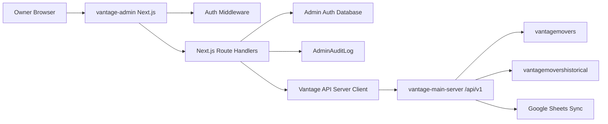

# Vantage Admin Dashboard Technical Architecture

## System Boundary

`vantage-admin` is a separate Next.js application. It owns:

- Admin authentication.
- Admin sessions.
- Admin UI.
- Server-side proxy calls to `vantage-main-server`.
- Admin audit logging.
- Frontend dropdown constants.

`vantage-main-server` owns:

- Operational data validation.
- Operational reads and writes.
- Booking business rules.
- Cancellation business rules.
- Google Sheet sync side effects.
- Analytics aggregation endpoints.
- CSV export endpoints.
- Production and historical database access for business records.

## Architecture Diagram



## Recommended Tech Stack

- Next.js App Router
- TypeScript
- Tailwind CSS
- shadcn/ui
- TanStack Query
- Recharts
- React Hook Form
- Zod
- Mongoose or MongoDB Node driver for admin auth collections
- `bcryptjs` or `bcrypt` for password hashing
- `jsonwebtoken` or `jose` for JWT signing and verification

## Project Shape

Create the Next.js app inside `vantage-admin`.

Recommended folders:

```text
vantage-admin/
  app/
    (auth)/
      login/
        page.tsx
    (dashboard)/
      layout.tsx
      page.tsx
      form-leads/
      call-leads/
      bookings/
      cancellations/
      customers/
      agents/
      analytics/
      audit-log/
      exports/
      settings/
    api/
      auth/
      proxy/
      exports/
  components/
    charts/
    data-table/
    filters/
    forms/
    layout/
    record-detail/
    ui/
  lib/
    api/
    auth/
    audit/
    constants/
    db/
    env/
    query/
    utils/
  server/
    auth/
    audit/
    vantage-api/
  types/
```

## Environment Variables

`vantage-admin`:

- `MONGODB_URI`
- `ADMIN_AUTH_DB_NAME`
- `ADMIN_ACCESS_TOKEN_SECRET`
- `ADMIN_REFRESH_TOKEN_SECRET`
- `ADMIN_ACCESS_TOKEN_TTL_SECONDS`
- `ADMIN_REFRESH_TOKEN_TTL_DAYS`
- `VANTAGE_API_BASE_URL`
- `VANTAGE_API_SECRET`
- `NEXT_PUBLIC_APP_NAME`

`VANTAGE_API_SECRET` must never be exposed to browser code.

## Auth Design

Use custom Mongo-backed auth in `vantage-admin`.

### AdminUser

Suggested collection: `admin_users`

Fields:

- `_id`
- `email`
- `password_hash`
- `role`
- `active`
- `created_at`
- `updated_at`
- `last_login_at`
- `password_changed_at`

Indexes:

- Unique `email`.
- Partial or normal index on `active`.

### Session Model

Use:

- Short-lived access JWT.
- Refresh token stored in an HTTP-only, secure cookie.
- Refresh token rotation if practical.
- Server middleware to protect dashboard routes.

Access token claims:

- `sub`
- `email`
- `role`
- `iat`
- `exp`

Refresh token claims:

- `sub`
- `token_version` or `session_id`
- `iat`
- `exp`

### Auth Routes

Next.js route handlers:

- `POST /api/auth/login`
- `POST /api/auth/refresh`
- `POST /api/auth/logout`
- `GET /api/auth/me`

Login should:

- Validate email and password.
- Check `AdminUser.active`.
- Verify password hash.
- Issue cookies.
- Record audit event.

Logout should:

- Clear cookies.
- Record audit event.

Refresh failure should:

- Clear cookies.
- Record audit event if a user can be resolved.

## Audit Logging

Suggested collection: `admin_audit_logs`

Fields:

- `_id`
- `timestamp`
- `admin_user_id`
- `admin_email`
- `action`
- `entity_type`
- `entity_id`
- `database_scope`
- `request_payload`
- `response_status`
- `ok`
- `error_message`
- `request_id`
- `ip_address`
- `user_agent`

Audit logs live in `vantage-admin` because they describe admin UI activity and proxied requests.

## API Proxy Design

Browser code calls `vantage-admin` route handlers.

`vantage-admin` route handlers call `vantage-main-server` with:

- `x-api-secret: VANTAGE_API_SECRET`
- JSON body where applicable
- Query params for filters

Benefits:

- The API secret stays server-side.
- Browser CORS issues are avoided.
- Audit logging can wrap mutations and exports.
- The frontend gets one normalized error envelope.

## Vantage API Client

Create a server-only client in:

```text
vantage-admin/server/vantage-api/client.ts
```

Responsibilities:

- Build URLs from `VANTAGE_API_BASE_URL`.
- Attach `x-api-secret`.
- Parse `{ ok, data, error }`.
- Throw typed errors.
- Support JSON and CSV responses.
- Include request ids if the backend exposes them.

Do not import this client into client components.

## Data Fetching

Use TanStack Query for:

- Table data.
- Detail drawers.
- Mutations.
- Analytics cards and charts.
- Cache invalidation after writes.

Use URL search params for:

- Page number or cursor.
- Page size.
- Sort.
- Direction.
- Filters.
- Database scope.

Pattern:

- Server route handler receives browser request.
- Route handler calls `vantage-main-server`.
- Client component uses TanStack Query against the local route handler.

## UI Component Strategy

Use shadcn/ui for:

- Buttons
- Inputs
- Selects
- Dialogs
- Drawers or sheets
- Dropdown menus
- Tabs
- Cards
- Tables
- Toasts
- Date picker composition

Use custom components for:

- Server-driven data table shell.
- Filter bar.
- Date range picker.
- Database scope selector.
- Record status badges.
- Money formatting.
- CSV export button.
- Audit event viewer.

## Charts

Use Recharts for:

- Line charts for time series.
- Bar charts for source and agent rankings.
- Pie or donut charts only where they stay readable.
- Stacked bars for booked/cancelled comparisons.

Charts should use the same filter state as analytics tables.

Each chart should expose the underlying data table where useful, especially for CSV export parity.

## Backend Integration Rules

All operational writes must call `vantage-main-server`.

Writes:

- Create booking.
- Update booking.
- Create cancellation.
- Update cancellation.
- Update form lead.
- Update call lead.
- Update customer.

No v1 UI path calls delete endpoints.

No v1 UI path writes directly to `vantagemovers` or `vantagemovershistorical`.

## Error Handling

Show:

- Field-level validation errors where possible.
- Toasts for mutation success/failure.
- Inline empty states for no results.
- Clear conflict messages for already-cancelled or already-booked records.

Preserve backend error messages when they are owner-friendly. Otherwise, map them to clearer UI text and include technical detail in an expandable area.

## Security Requirements

- All dashboard routes require auth.
- Auth cookies are HTTP-only, secure, same-site.
- Access token TTL should be short.
- Refresh token TTL should be reasonable for owner workflow.
- Do not store `VANTAGE_API_SECRET` in client bundles.
- Do not log raw passwords or auth tokens.
- Redact sensitive fields from audit payloads.
- Historical records are read-only in UI and backend admin routes.
- CSV exports require auth and audit logging.

## Deployment

Deploy `vantage-admin` as a separate Vercel app.

Deployment checklist:

- Configure all env vars in Vercel.
- Confirm `VANTAGE_API_BASE_URL` points to production `vantage-main-server`.
- Confirm `VANTAGE_API_SECRET` matches server configuration.
- Seed initial admin user.
- Confirm login/logout/refresh on production domain.
- Confirm no browser network request contains `x-api-secret`.
- Confirm production and historical scopes return expected data.

## Testing Strategy

Unit tests:

- Auth validation.
- JWT signing/verification.
- API client response parsing.
- Filter serialization.
- Dropdown mapping.

Integration tests:

- Login flow.
- Protected route redirect.
- Proxy route success and failure.
- Audit logging on mutation.

E2E tests:

- Owner signs in.
- Owner browses leads.
- Owner filters bookings.
- Owner books a selected lead.
- Owner cancels a selected booking.
- Owner views analytics.
- Owner exports CSV.

## Key Existing Backend Files

- `vantage-main-server/api/routes/v1.routes.ts`
- `vantage-main-server/api/services/v1.service.ts`
- `vantage-main-server/api/models/`
- `vantage-main-server/api/services/bookings/`
- `vantage-main-server/api/services/cancellations/`
- `vantage-main-server/api/services/search/`
- `vantage-main-server/api/validation/v1/`
- `vantage-main-server/scripts/historical/historical-analytics.ts`
- `vantage-main-server/scripts/historical/models/`
- `vantage-main-server/scripts/google_apps_scripts/create-booked-lead-form.gs`
- `vantage-main-server/docs/cancellation_form.gs`
